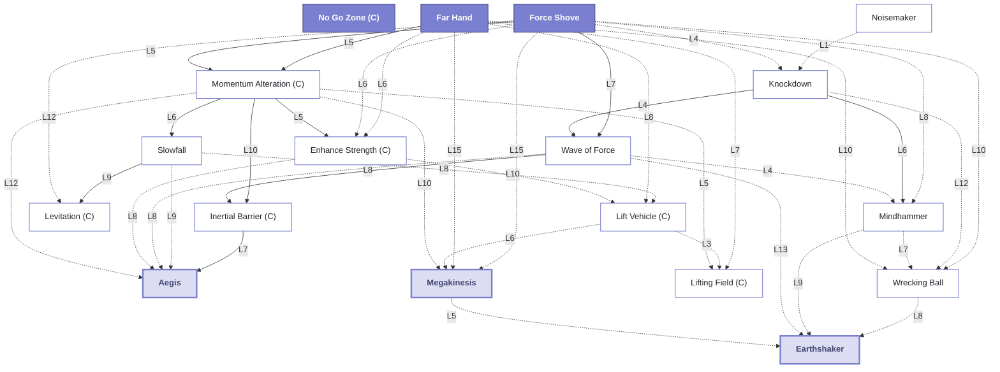
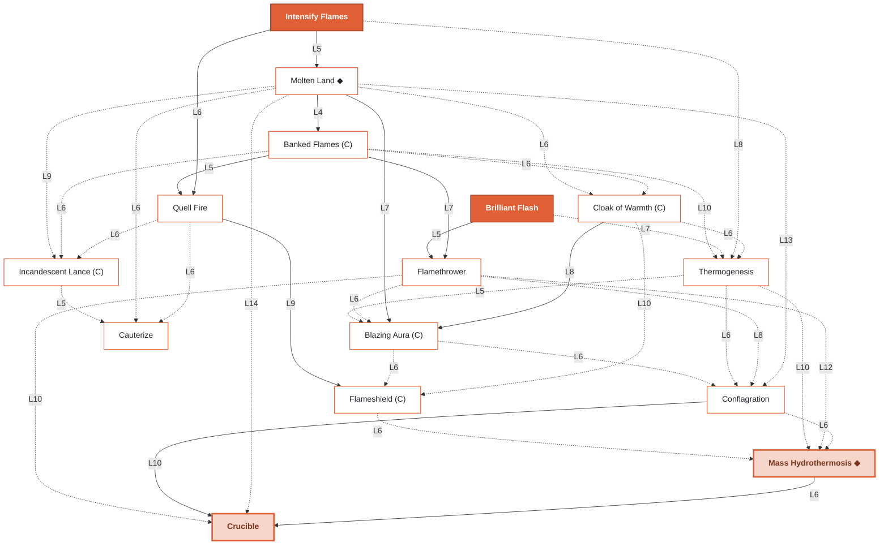
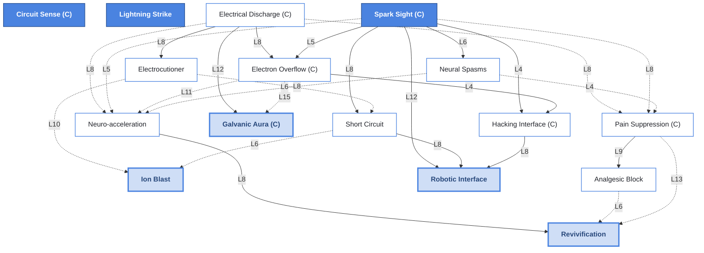
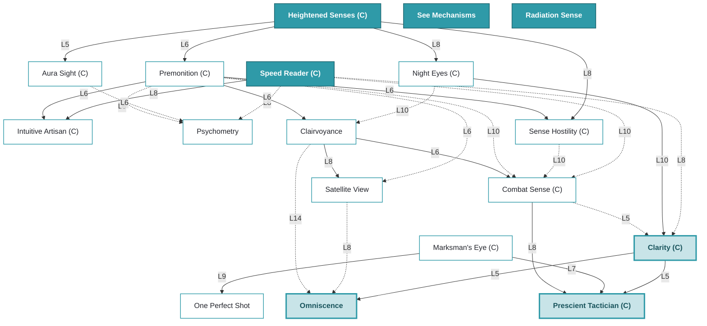
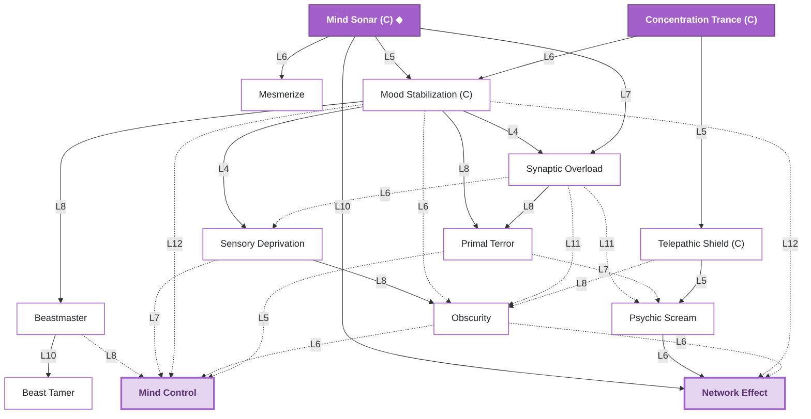
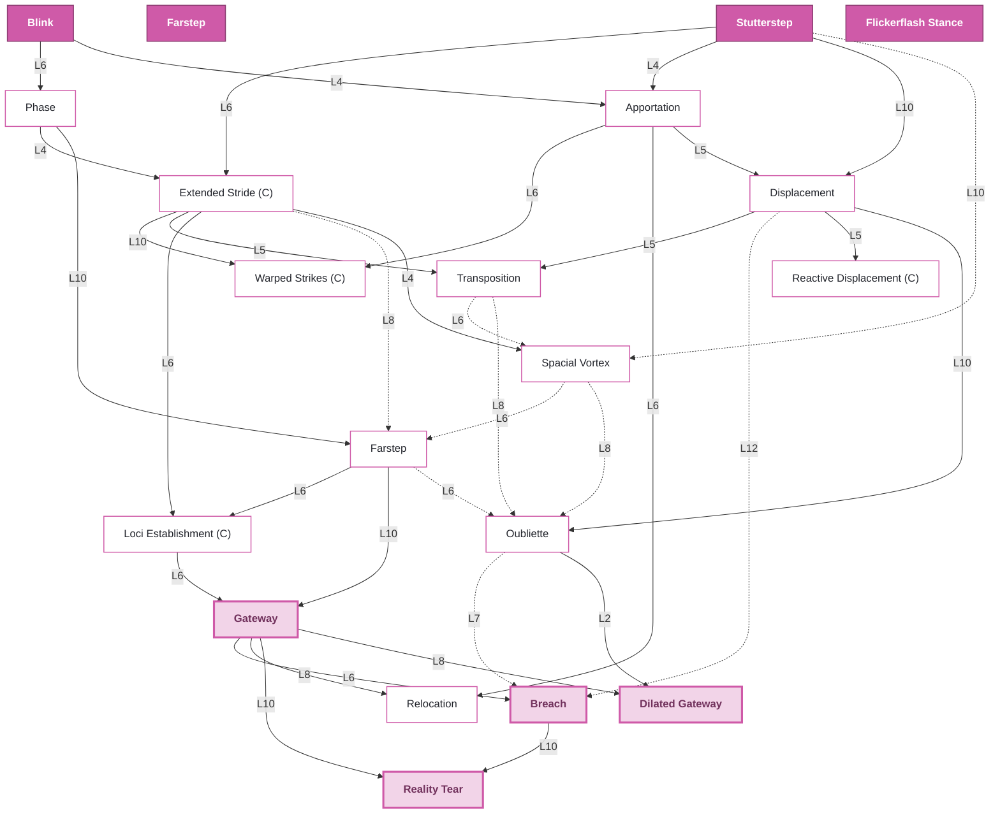

# Psionic Discipline Atlas

Power-acquisition trees for the eight psionic schools in **Mind Over Matter (BN)**.
Vitakinesis merged into Biokinesis 2026-08-07 (see `HANDOFF.md`'s changelog) — there
were nine schools before that.

## How powers unlock

Powers are not bought — they surface. Once you meet a power's prerequisite spell-levels and log enough practice time (paced by Intelligence and Metaphysics), an insight arrives and the power is learned outright. No dice, no recipe grind.

Reading the trees:

| Notation | Meaning |
|---|---|
| solid arrow | required prerequisite |
| dashed arrow | alternate route — any one of the converging paths opens the power |
| `L7` on an arrow | minimum level of that prerequisite |
| filled node | foundation — known from the moment you take up the school |
| outlined node | trained via prerequisites |
| thick-bordered node | advanced / capstone |
| `(C)` in a name | concentration power, maintained while held |
| ◆ after a name | fork power — behaves differently from its DDA counterpart |

## Disciplines

- [Biokinesis](#biokinesis) — 20 powers
- [Telekinesis](#telekinesis) — 18 powers
- [Pyrokinesis](#pyrokinesis) — 15 powers
- [Electrokinesis](#electrokinesis) — 16 powers
- [Photokinesis](#photokinesis) — 20 powers
- [Clairsentience](#clairsentience) — 18 powers
- [Telepathy](#telepathy) — 14 powers
- [Teleportation](#teleportation) — 20 powers

---

## Biokinesis

*Turn the body into an instrument — reflexes, resilience, reshaped flesh, and
(since the Vitakinesis merge) the body's own repair.*

**20** powers · **5** known at start · **15** trainable

**Foundations:** Healthy Glow (C) · Overcome Pain (C) · Personal Enhancement (C) ·
Radiation Decontamination · Staunch Wound

```mermaid
graph TD
  n_biokin_adrenaline["Adrenaline Trigger"]:::power
  n_biokin_armor_skin["Hardened Skin (C)"]:::power
  n_biokin_breathe_skin["Oxygen Absorption (C)"]:::power
  n_biokin_climate_control["Temperature Adaptability (C)"]:::power
  n_biokin_combat_dance["Combat Dance (C)"]:::apex
  n_biokin_dash["Burst of Speed"]:::power
  n_biokin_enhance_mobility["Enhance Mobility (C)"]:::power
  n_biokin_hammerhand["Hammerhand (C)"]:::power
  n_biokin_hurricane_blows["Hurricane Blows"]:::apex
  n_biokin_metabolism_enhance["Metabolic Hyperefficiency (C)"]:::power
  n_biokin_overcome_pain["Overcome Pain (C)"]:::start
  n_biokin_perfected_motion["Perfected Motion (C)"]:::apex
  n_biokin_physical_enhance["Personal Enhancement (C)"]:::start
  n_biokin_reflex_enhance["Heightened Reflexes (C)"]:::power
  n_biokin_sealed_system["Sealed System"]:::power
  n_vita_health_power["Healthy Glow (C)"]:::start
  n_vita_purge_rads["Radiation Decontamination"]:::start
  n_vita_remove_poison["Detoxification"]:::power
  n_vita_stop_bleeding["Staunch Wound"]:::start
  n_vita_super_heal["Anabolic Rejuvenation (C)"]:::apex
  n_biokin_dash -.->|L8| n_biokin_adrenaline
  n_biokin_breathe_skin -.->|L5| n_biokin_adrenaline
  n_biokin_enhance_mobility -.->|L6| n_biokin_adrenaline
  n_biokin_physical_enhance -.->|L8| n_biokin_armor_skin
  n_vita_remove_poison -.->|L7| n_biokin_armor_skin
  n_biokin_climate_control -.->|L6| n_biokin_armor_skin
  n_biokin_overcome_pain -.->|L6| n_biokin_armor_skin
  n_biokin_physical_enhance -->|L4| n_biokin_breathe_skin
  n_biokin_overcome_pain -->|L3| n_biokin_breathe_skin
  n_biokin_physical_enhance -.->|L9| n_biokin_climate_control
  n_biokin_overcome_pain -.->|L5| n_biokin_climate_control
  n_biokin_metabolism_enhance -.->|L6| n_biokin_climate_control
  n_biokin_physical_enhance -.->|L10| n_biokin_combat_dance
  n_biokin_reflex_enhance -.->|L10| n_biokin_combat_dance
  n_biokin_dash -.->|L6| n_biokin_combat_dance
  n_biokin_adrenaline -.->|L9| n_biokin_combat_dance
  n_biokin_enhance_mobility -.->|L6| n_biokin_dash
  n_biokin_reflex_enhance -.->|L5| n_biokin_dash
  n_biokin_adrenaline -.->|L8| n_biokin_dash
  n_biokin_physical_enhance -.->|L5| n_biokin_dash
  n_biokin_dash -.->|L10| n_biokin_enhance_mobility
  n_biokin_reflex_enhance -.->|L6| n_biokin_enhance_mobility
  n_biokin_overcome_pain -.->|L4| n_biokin_enhance_mobility
  n_vita_remove_poison -.->|L9| n_biokin_enhance_mobility
  n_biokin_combat_dance -.->|L4| n_biokin_enhance_mobility
  n_biokin_physical_enhance -.->|L10| n_biokin_enhance_mobility
  n_biokin_physical_enhance -->|L6| n_biokin_hammerhand
  n_biokin_armor_skin -->|L6| n_biokin_hammerhand
  n_biokin_combat_dance -.->|L10| n_biokin_hurricane_blows
  n_biokin_reflex_enhance -.->|L14| n_biokin_hurricane_blows
  n_biokin_adrenaline -.->|L12| n_biokin_hurricane_blows
  n_biokin_climate_control -.->|L8| n_biokin_metabolism_enhance
  n_biokin_adrenaline -.->|L6| n_biokin_metabolism_enhance
  n_biokin_physical_enhance -.->|L12| n_biokin_metabolism_enhance
  n_biokin_combat_dance -->|L6| n_biokin_perfected_motion
  n_biokin_dash -->|L12| n_biokin_perfected_motion
  n_biokin_physical_enhance -.->|L6| n_biokin_reflex_enhance
  n_biokin_adrenaline -.->|L8| n_biokin_reflex_enhance
  n_biokin_dash -.->|L8| n_biokin_reflex_enhance
  n_vita_remove_poison -.->|L8| n_biokin_reflex_enhance
  n_biokin_breathe_skin -.->|L9| n_biokin_sealed_system
  n_biokin_hammerhand -.->|L7| n_biokin_sealed_system
  n_biokin_climate_control -.->|L10| n_biokin_sealed_system
  n_biokin_armor_skin -.->|L9| n_biokin_sealed_system
  n_biokin_physical_enhance -->|L6| n_vita_remove_poison
  n_biokin_metabolism_enhance -->|L8| n_vita_super_heal
  n_biokin_adrenaline -->|L6| n_vita_super_heal
  classDef start fill:#c0495a,stroke:#82313d,color:#ffffff,stroke-width:1.5px,font-weight:600;
  classDef power fill:#ffffff,stroke:#c0495a,color:#22242b,stroke-width:1.4px;
  classDef apex fill:#eecfd4,stroke:#c0495a,color:#692831,stroke-width:3px,font-weight:700;
```

---

## Telekinesis

*Move matter by will alone: shove, crush, shield, and take to the air.*

**18** powers · **3** known at start · **15** trainable

**Foundations:** Far Hand · Force Shove · No Go Zone (C)

---

## Pyrokinesis

*Kindle and command heat — from a warming cloak to lava underfoot and foes boiled from within.*

**15** powers · **2** known at start · **13** trainable

**Foundations:** Brilliant Flash · Intensify Flames

---

## Electrokinesis

*Command current: spark, arc, and read the hidden circuits of the world.*

**16** powers · **3** known at start · **13** trainable

**Foundations:** Circuit Sense (C) · Lightning Strike · Spark Sight (C)

---

## Photokinesis

*Bend light itself — blinding, cloaking, and conjured luminous constructs.*

**20** powers · **2** known at start · **18** trainable

**Foundations:** Candle's Glow (C) · Field of Light

```mermaid
graph TD
  n_photokinetic_blinding_glare["Blinding Radiance (C)"]:::power
  n_photokinetic_camouflage["Chameleoflage (C)"]:::power
  n_photokinetic_create_light["Field of Light"]:::start
  n_photokinetic_flash_bang["Flashbang"]:::power
  n_photokinetic_hide_ugly["Mirror-Mask (C)"]:::power
  n_photokinetic_invisibility["Veil of Light (C)"]:::power
  n_photokinetic_light_arms["Refracted Arms"]:::power
  n_photokinetic_light_army["Phantom Legion (C)"]:::apex
  n_photokinetic_light_beam["Photon Beam"]:::power
  n_photokinetic_light_disintegrate["Luminous Disintegration"]:::apex
  n_photokinetic_light_dodge["Trick of the Light (C)"]:::power
  n_photokinetic_light_flash["Star Flash"]:::power
  n_photokinetic_light_image["Lucid Shadows"]:::power
  n_photokinetic_light_local["Candle's Glow (C)"]:::start
  n_photokinetic_light_up_enemy["Illuminate"]:::power
  n_photokinetic_rad_immunity["Lucent Barrier (C)"]:::power
  n_photokinetic_radio["Radio Transception (C)"]:::power
  n_photokinetic_snuff_light["Blackout"]:::power
  n_photokinetic_sterilize_food["Gamma Sterilization"]:::power
  n_photokinetic_stun_robots["Sensor Jamming"]:::power
  n_photokinetic_light_flash -.->|L6| n_photokinetic_blinding_glare
  n_photokinetic_flash_bang -.->|L7| n_photokinetic_blinding_glare
  n_photokinetic_rad_immunity -.->|L10| n_photokinetic_blinding_glare
  n_photokinetic_create_light -.->|L12| n_photokinetic_blinding_glare
  n_photokinetic_light_dodge -->|L6| n_photokinetic_camouflage
  n_photokinetic_create_light -.->|L9| n_photokinetic_flash_bang
  n_photokinetic_light_beam -.->|L5| n_photokinetic_flash_bang
  n_photokinetic_light_up_enemy -->|L6| n_photokinetic_flash_bang
  n_photokinetic_camouflage -->|L8| n_photokinetic_hide_ugly
  n_photokinetic_rad_immunity -->|L5| n_photokinetic_hide_ugly
  n_photokinetic_light_image -.->|L6| n_photokinetic_invisibility
  n_photokinetic_camouflage -.->|L10| n_photokinetic_invisibility
  n_photokinetic_hide_ugly -.->|L6| n_photokinetic_invisibility
  n_photokinetic_rad_immunity -.->|L6| n_photokinetic_invisibility
  n_photokinetic_camouflage -->|L6| n_photokinetic_light_arms
  n_photokinetic_light_local -->|L6| n_photokinetic_light_arms
  n_photokinetic_light_dodge -->|L8| n_photokinetic_light_arms
  n_photokinetic_light_image -->|L10| n_photokinetic_light_army
  n_photokinetic_blinding_glare -.->|L6| n_photokinetic_light_army
  n_photokinetic_light_arms -.->|L10| n_photokinetic_light_army
  n_photokinetic_create_light -.->|L14| n_photokinetic_light_army
  n_photokinetic_light_local -.->|L8| n_photokinetic_light_beam
  n_photokinetic_create_light -.->|L6| n_photokinetic_light_beam
  n_photokinetic_light_flash -.->|L8| n_photokinetic_light_disintegrate
  n_photokinetic_blinding_glare -->|L5| n_photokinetic_light_disintegrate
  n_photokinetic_light_beam -.->|L14| n_photokinetic_light_disintegrate
  n_photokinetic_snuff_light -->|L5| n_photokinetic_light_dodge
  n_photokinetic_create_light -->|L5| n_photokinetic_light_dodge
  n_photokinetic_light_arms -.->|L6| n_photokinetic_light_flash
  n_photokinetic_rad_immunity -.->|L6| n_photokinetic_light_flash
  n_photokinetic_light_beam -->|L8| n_photokinetic_light_flash
  n_photokinetic_light_arms -.->|L6| n_photokinetic_light_image
  n_photokinetic_camouflage -.->|L6| n_photokinetic_light_image
  n_photokinetic_light_beam -->|L6| n_photokinetic_light_image
  n_photokinetic_snuff_light -.->|L6| n_photokinetic_rad_immunity
  n_photokinetic_camouflage -.->|L5| n_photokinetic_rad_immunity
  n_photokinetic_light_dodge -.->|L9| n_photokinetic_rad_immunity
  n_photokinetic_create_light -.->|L8| n_photokinetic_radio
  n_photokinetic_rad_immunity -->|L6| n_photokinetic_radio
  n_photokinetic_light_beam -.->|L7| n_photokinetic_radio
  n_photokinetic_light_local -.->|L5| n_photokinetic_snuff_light
  n_photokinetic_create_light -.->|L4| n_photokinetic_snuff_light
  n_photokinetic_light_flash -.->|L3| n_photokinetic_sterilize_food
  n_photokinetic_camouflage -->|L4| n_photokinetic_sterilize_food
  n_photokinetic_rad_immunity -->|L7| n_photokinetic_sterilize_food
  n_photokinetic_light_up_enemy -.->|L9| n_photokinetic_sterilize_food
  n_photokinetic_light_beam -.->|L5| n_photokinetic_sterilize_food
  n_photokinetic_light_flash -.->|L5| n_photokinetic_stun_robots
  n_photokinetic_radio -.->|L6| n_photokinetic_stun_robots
  n_photokinetic_light_beam -.->|L4| n_photokinetic_stun_robots
  classDef start fill:#c99327,stroke:#88631a,color:#ffffff,stroke-width:1.5px,font-weight:600;
  classDef power fill:#ffffff,stroke:#c99327,color:#22242b,stroke-width:1.4px;
  classDef apex fill:#f0e2c6,stroke:#c99327,color:#6e5015,stroke-width:3px,font-weight:700;
```

---

## Clairsentience

*Perception unbound from the eyes: the unseen, the distant, the yet-to-come.*

**18** powers · **4** known at start · **14** trainable

**Foundations:** Heightened Senses (C) · Radiation Sense · See Mechanisms · Speed Reader (C)

---

## Telepathy

*Reach into other minds — to read, soothe, deceive, or shatter them.*

**14** powers · **2** known at start · **12** trainable

**Foundations:** Concentration Trance (C) · Mind Sonar (C)

---

## Teleportation

*Fold space to cross the battlefield — or drag others through the gap.*

**20** powers · **4** known at start · **16** trainable

**Foundations:** Blink · Farstep · Flickerflash Stance · Stutterstep

---

*Generated from the Psionic Discipline Atlas. Power names and prerequisites are derived from the mod's own `lua/gen_learn_map.lua` and `spells/*.json`, so this file tracks the shipped data rather than being maintained by hand.*
